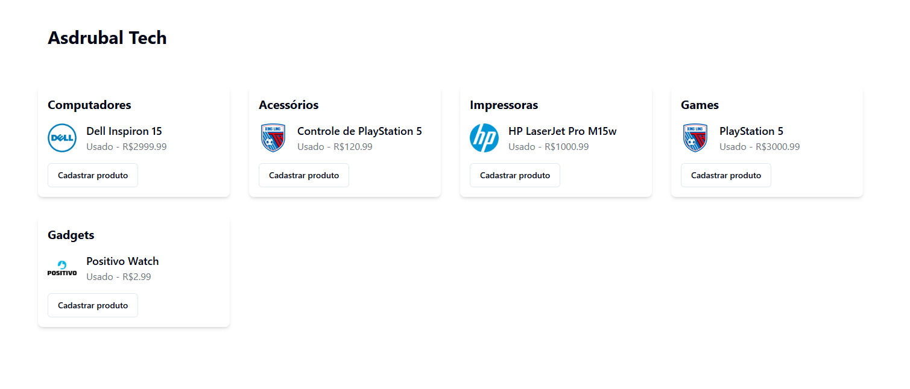

# Asdrubal Tech

- Projeto para a disciplina de Programação para Web II do curso de Análise e Desenvolvimento de Sistemas do IFSP São Carlos.

## Índice

- [Visão Geral](#visão-geral)
  - [Captura de Tela](#captura-de-tela)
  - [Construído com](#construído-com)
  - [Funcionalidades](#funcionalidades)
  - [Links](#links)
- [Agradecimentos](#agradecimentos)

## Visão Geral

### Captura de Tela

### Construído com

- 🛠️ **[TypeScript](https://www.typescriptlang.org/)** - Um superconjunto de JavaScript que adiciona tipagem estática ao idioma
- 🎨 **[TailwindCSS](https://tailwindcss.com/)** - Framework CSS utilitário para desenvolvimento rápido de UI
- 🧩 **[shadcn/ui](https://ui.shadcn.com/)** - Componentes de UI acessíveis e reutilizáveis
- ⚛️ **[React Hook Form](https://react-hook-form.com/)** - Formulários performáticos, flexíveis e extensíveis com validação fácil de usar
- 📜 **[Zod](https://zod.dev/)** - Declaração e validação de esquemas TypeScript-first
- ⚡ **[Vite](https://vitejs.dev/)** - Ferramenta de build rápida e moderna para projetos web

### Introdução às Tecnologias Usadas

- 🛠️ **TypeScript**: [TypeScript](https://www.typescriptlang.org/) é um superconjunto de JavaScript que adiciona tipagem estática ao idioma. Ele ajuda a detectar erros durante o desenvolvimento, melhorando a qualidade do código e a produtividade do desenvolvedor.
- ⚡**Vite**: [Vite](https://vitejs.dev/) é uma ferramenta de build rápida e moderna para projetos web, que oferece uma experiência de desenvolvimento mais ágil e eficiente em comparação com ferramentas tradicionais como o Create React App.
- ⚛️ **React Hook Form**: [React Hook Form](https://react-hook-form.com/) é uma biblioteca para gerenciamento de formulários em React. Ela é performática, flexível e extensível, facilitando a validação e o gerenciamento de estados dos formulários.
- 🧩 **shadcn/ui**: [shadcn/ui](https://ui.shadcn.com/) é uma coleção de componentes de interface do usuário acessíveis e reutilizáveis, que ajudam a construir interfaces de usuário consistentes e acessíveis.
- 🎨 **TailwindCSS**: [TailwindCSS](https://tailwindcss.com/) é um framework CSS utilitário que permite a construção rápida de interfaces de usuário estilizadas, utilizando classes utilitárias diretamente no HTML.

### Funcionalidades

- 📂 Listagem de produtos categorizados em seções: Computadores, Acessórios, Impressoras, Games e Gadgets
- 🏷️ Marcas disponíveis: HP, Dell, Positivo, Asus e Xing Ling Genérico
- 🛒 Registro de novos produtos na loja

### Links

- 🚀 URL do Site: Não disponível ainda!

## Agradecimentos

Um agradecimento especial a todos os contribuidores de código aberto e aos criadores das bibliotecas e ferramentas utilizadas neste projeto.